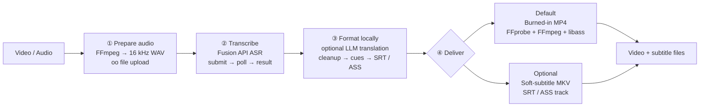

# Video Subtitle Translator

[English](README.md) | [简体中文](README.zh-CN.md)

An AI-agent skill for creating, translating, formatting, and delivering subtitles for local audio and video.

It combines FFmpeg, the OOMOL Fusion API, an optional OOMOL-configured LLM, and a bundled Node.js helper to produce readable subtitle files and subtitled videos. Video delivery defaults to a burned-in MP4, with selectable soft-subtitle MKV as an alternative.

## Features

- Extract and normalize audio from local video with FFmpeg.
- Upload local media through the `oo` CLI and transcribe it with Fusion API ASR.
- Generate timed SRT and WebVTT subtitles from word-level timestamps.
- Remove narrowly scoped Fusion ASR artifacts without rewriting user-provided or translated subtitle text.
- Translate subtitle cues with an OpenAI-compatible LLM configured by `oo llm config`.
- Resume interrupted translations only when checkpoint cue indexes and source text still match.
- Reflow CJK and Latin subtitles into readable display lines.
- Generate resolution-aware ASS subtitles for consistent styling and positioning.
- Burn subtitles into MP4 by default, or package selectable SRT/ASS tracks into MKV.

## Architecture



The main responsibility boundary is:

```text
Cloud: media hosting, speech recognition, and optional translation
Local: timestamp normalization, ASR cleanup, cue layout, ASS styling, and video delivery
```

## Requirements

- [Node.js](https://nodejs.org/) 18 or newer
- `ffmpeg` and `ffprobe`
- The OOMOL `oo` CLI, authenticated and able to use:
  - `oo file upload`
  - the `fusion-api` connector
  - `oo llm config` when translation is requested

Check the local runtime:

```bash
node --version
ffmpeg -version
ffprobe -version
oo --version
```

## Installation

Clone the repository into an agent skills directory:

```bash
git clone https://github.com/oomol-lab/video-subtitle-translator.git \
  ~/.agents/skills/video-subtitle-translator
```

Alternatively, clone it anywhere and link it into the skills directory:

```bash
git clone https://github.com/oomol-lab/video-subtitle-translator.git
mkdir -p ~/.agents/skills
ln -s "$(pwd)/video-subtitle-translator" \
  ~/.agents/skills/video-subtitle-translator
```

Restart or refresh the agent environment after installation so it can discover `SKILL.md`.

## Usage

The skill is designed to be invoked through an AI agent. Example requests:

```text
Create Simplified Chinese subtitles for this video and burn them into an MP4.
```

```text
Transcribe this audio and return SRT and VTT files without translation.
```

```text
Translate this interview into Japanese and package the subtitles as a selectable MKV track.
```

```text
Create natural Chinese subtitles for this technical course. Keep API names and code terms in English.
```

If translation is clearly requested but the target language is omitted, the skill infers the target from the language of the request. If it is unclear whether translation is wanted, the agent asks before starting the job.

## Processing Pipeline

### 1. Audio preparation and upload

For local video or media that needs normalization, the skill extracts a mono 16 kHz WAV:

```bash
ffmpeg -y -i "$INPUT_MEDIA" \
  -vn -ac 1 -ar 16000 -c:a pcm_s16le \
  "$WORK_DIR/audio.wav"
```

The local file is uploaded before it is passed to the cloud ASR service:

```bash
oo file upload "$AUDIO_PATH" --json
```

Only the returned public `downloadUrl` is sent to Fusion API. Local filesystem paths are never passed directly to the cloud action.

### 2. Fusion API transcription

The ASR workflow uses three connector actions:

```text
qwen_asr_filetrans_submit
        ↓
qwen_asr_filetrans_state
        ↓
qwen_asr_filetrans_result
```

The full result is preserved as `transcript.json`. Fusion timestamps are treated as milliseconds by default and normalized to seconds locally.

### 3. Local subtitle formatting

The bundled helper provides four commands:

```bash
node scripts/subtitle-tools.mjs fusion-to-subtitles --help
node scripts/subtitle-tools.mjs translate-srt --help
node scripts/subtitle-tools.mjs prepare-display-srt --help
node scripts/subtitle-tools.mjs srt-to-burn-ass --help
```

Typical transcript conversion:

```bash
node scripts/subtitle-tools.mjs fusion-to-subtitles \
  --input "$WORK_DIR/transcript.json" \
  --out-dir "$WORK_DIR" \
  --time-unit ms \
  --formats srt
```

Typical display formatting:

```bash
node scripts/subtitle-tools.mjs prepare-display-srt \
  --input "$WORK_DIR/translation.zh.srt" \
  --output "$WORK_DIR/translation.zh.display.srt" \
  --cjk-line-length 18 \
  --max-lines 2
```

### 4. Video delivery

#### Burned-in MP4 — default

The final SRT is converted to ASS using the real video dimensions, then burned into the video:

```bash
ffmpeg -y -i "$INPUT_VIDEO" \
  -vf "ass=$WORK_DIR/subtitles.burn.ass" \
  -c:v libx264 -crf 18 -preset medium \
  -c:a copy -sn \
  "$OUTPUT_VIDEO.burned.mp4"
```

Use this mode for social platforms, mobile playback, uploads, and other environments where subtitles must always be visible.

#### Soft-subtitle MKV — optional

Package a selectable subtitle track without burning it into the image:

```bash
ffmpeg -y -i "$INPUT_VIDEO" -i "$SUBTITLE_SRT" \
  -map 0:v? -map 0:a? -map 1:0 \
  -c copy -c:s srt \
  -disposition:s:0 default \
  -metadata:s:s:0 language="$LANG_CODE" \
  "$OUTPUT_VIDEO.subtitled.mkv"
```

Use this mode when subtitles should remain selectable or editable, when multiple subtitle languages are needed, or when avoiding video re-encoding matters.

## Translation

Translation uses the OpenAI-compatible model returned by:

```bash
oo llm config --json
```

The helper translates cue text in batches while preserving indexes and timestamps. It supports translation profiles for film and television, technical courses, interviews, news, business training, gaming, children’s content, and general video.

To resume an interrupted translation:

```bash
node scripts/subtitle-tools.mjs translate-srt \
  --input "$WORK_DIR/transcript.srt" \
  --out-dir "$WORK_DIR" \
  --target-language "Simplified Chinese" \
  --target-code zh \
  --resume
```

Checkpoint entries are reused only when both the cue index and saved source text match the current SRT.

## ASR Cleanup Policy

Noise cleanup is intentionally restricted to Fusion ASR input:

- A complete ASR token containing only three or more zeroes, such as `000`, is treated as a probable artifact.
- Duplicate punctuation is not appended when the ASR word already contains it.
- Normal expressive forms such as `...`, `??`, `!!`, and `?!` are preserved.
- Only clearly excessive punctuation runs are normalized.
- User-provided SRT, LLM translations, and checkpoint text are not subjected to destructive cleanup.

When cleanup occurs, the helper reports how many probable zero artifacts and punctuation runs were repaired.

## Outputs

A typical job can produce:

```text
job.created.json
job.done.json
transcript.json
transcript.txt
transcript.srt
transcript.word-timed.srt
translation.<language>.json
translation.<language>.srt
translation.<language>.display.srt
translation.<language>.display.ass
<name>.burned.mp4
<name>.subtitled.mkv
```

## Security and Privacy

- Local media is uploaded to obtain a URL that Fusion API can access.
- Translation text is sent to the LLM configured by `oo llm config`.
- API keys are read at runtime and must not be committed, printed, or written into output files.
- Raw transcript JSON is preserved locally for debugging and recovery, but should not be published when it contains sensitive speech.

## Contributing

Issues and pull requests are welcome. When changing subtitle conversion behavior, include a small fixture that covers the affected timestamp, punctuation, language, or checkpoint edge case.

Before submitting a change, at minimum run:

```bash
node --check scripts/subtitle-tools.mjs
node scripts/subtitle-tools.mjs --help
```

## License

[MIT](LICENSE) © 2026 OOMOL Lab
