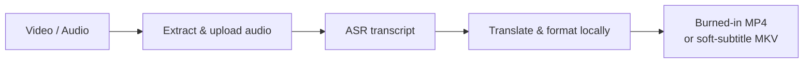

# Video Subtitle Translator

[English](README.md) | [简体中文](README.zh-CN.md)

An AI-agent skill that turns audio or video into translated, readable
subtitles—and delivers a ready-to-share video.

It transcribes speech with OOMOL Fusion API, optionally translates it, formats
the subtitles locally, then burns them into MP4 by default. Selectable subtitle
tracks in MKV are also supported.

## See it in action

### English → Simplified Chinese

[](assets/demos/english-to-chinese.mp4)

[▶ Watch the full MP4](assets/demos/english-to-chinese.mp4)

### Japanese → English and Simplified Chinese

[](assets/demos/japanese-to-english-chinese.mp4)

[▶ Watch the full MP4](assets/demos/japanese-to-english-chinese.mp4)

The Japanese preview shows the Simplified Chinese burn-in; the same workflow
can output English subtitles. Demo media credits and licenses are listed in the
[guide](docs/guide.md#demo-media).

## What it does

- Transcribes local audio or video into timed subtitles.
- Translates subtitles while preserving cue order and timing.
- Produces readable SRT, VTT, and styled ASS files.
- Burns subtitles into MP4 by default, or packages selectable tracks in MKV.

## How it works



FFmpeg prepares the audio, `oo` uploads it and calls Fusion API ASR, the bundled
helper builds and optionally translates subtitles locally, and FFmpeg produces
the final video.

## Quick start

Requirements: Node.js 18+, FFmpeg/FFprobe, and an authenticated
[OOMOL `oo` CLI](https://static.oomol.com/oo-cli/skill-install-guide/install.md).

Install the public skill:

```bash
oo skills install @alwaysmavs/video-subtitle-translator
```

Then ask your agent in natural language:

```text
Translate this English video into Simplified Chinese and burn the subtitles into an MP4.
```

```text
Translate this Japanese video into English and Chinese subtitles, and package them as selectable MKV tracks.
```

If no delivery mode is specified, the skill creates a burned-in MP4. Ask for
MKV, soft subtitles, selectable tracks, or no re-encoding when you want a soft
subtitle output.

## Documentation

- [Setup, workflow, output files, privacy, and troubleshooting](docs/guide.md)
- [Complete agent instructions](SKILL.md)
- [oo CLI setup and recovery](references/oo-cli-setup.md)

## License

[MIT](LICENSE) © 2026 OOMOL Lab
