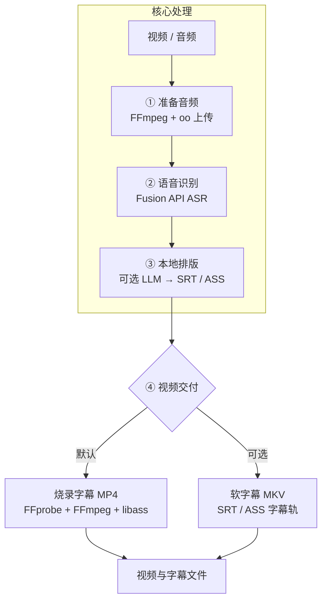

# Video Subtitle Translator

[English](README.md) | [简体中文](README.zh-CN.md)

一个用于创建、翻译、排版和交付音视频字幕的 AI Agent Skill。

它组合使用 FFmpeg、OOMOL Fusion API、可选的 OOMOL LLM 配置和内置 Node.js 工具，生成可读的字幕文件与带字幕视频。视频默认交付为烧录字幕的 MP4，也支持将可开关字幕封装进 MKV。

## 功能

- 使用 FFmpeg 从本地视频提取并规范化音频。
- 通过 `oo` CLI 上传本地媒体，并调用 Fusion API ASR 生成逐字稿。
- 根据词级时间戳生成 SRT 和 WebVTT 字幕。
- 只清理 Fusion ASR 边界内的已知噪声，不改写用户字幕和翻译结果。
- 使用 `oo llm config` 配置的 OpenAI-compatible LLM 翻译字幕。
- 仅在 checkpoint 的 cue 序号和原文同时匹配时恢复翻译。
- 针对 CJK 和拉丁文字进行可读性换行。
- 根据真实视频分辨率生成 ASS 字幕，保证样式和位置稳定。
- 默认烧录字幕 MP4，也可将 SRT/ASS 字幕轨封装进 MKV。

## 架构



主要职责边界：

```text
云端：媒体托管、语音识别、可选字幕翻译
本地：时间轴转换、ASR 清理、字幕排版、ASS 样式和视频交付
```

## 环境要求

- [Node.js](https://nodejs.org/) 18 或更高版本
- `ffmpeg` 和 `ffprobe`
- 必须安装并完成认证的 OOMOL `oo` CLI：
  - `oo file upload`
  - `fusion-api` connector
  - 翻译时使用的 `oo llm config`

检查本地运行环境：

```bash
node --version
ffmpeg -version
ffprobe -version
oo --version
```

### 安装必需的 oo CLI

没有 `oo`，这个 Skill 无法运行 ASR 和字幕翻译流程。如果尚未安装，Agent
会停止任务并引导用户完成一次性安装；未经用户同意，不会自行安装软件。

macOS 或 Linux：

```bash
curl -fsSL https://cli.oomol.com/install.sh | bash
```

Windows PowerShell：

```powershell
irm https://cli.oomol.com/install.ps1 | iex
```

安装后请打开新终端或刷新 `PATH`，然后完成认证：

```bash
oo --version
oo auth login
```

其他安装方式参见 [官方安装指南](https://cli.oomol.com/install-guide.md)。

## 安装 Skill

将仓库克隆到 Agent Skills 目录：

```bash
git clone https://github.com/oomol-lab/video-subtitle-translator.git \
  ~/.agents/skills/video-subtitle-translator
```

也可以克隆到任意目录，然后创建软链接：

```bash
git clone https://github.com/oomol-lab/video-subtitle-translator.git
mkdir -p ~/.agents/skills
ln -s "$(pwd)/video-subtitle-translator" \
  ~/.agents/skills/video-subtitle-translator
```

安装完成后，重启或刷新 Agent 环境，使其重新发现 `SKILL.md`。

## 使用方法

这个 Skill 主要通过 AI Agent 调用。示例请求：

```text
为这个视频生成简体中文字幕，并烧录成 MP4。
```

```text
转录这段音频，返回 SRT 和 VTT，不要翻译。
```

```text
把这个访谈翻译成日语，并把字幕封装成可开关的 MKV 字幕轨。
```

```text
为这个技术课程制作自然的中文字幕，API 名称和代码术语保留英文。
```

如果用户明确要求翻译但没有指定目标语言，Skill 会根据请求所使用的语言推断目标语言。如果无法确定用户是否需要翻译，Agent 会在开始任务前询问。

## 处理流程

### 1. 准备并上传音频

对于本地视频或需要规范化的媒体，Skill 会提取单声道 16 kHz WAV：

```bash
ffmpeg -y -i "$INPUT_MEDIA" \
  -vn -ac 1 -ar 16000 -c:a pcm_s16le \
  "$WORK_DIR/audio.wav"
```

本地文件在提交云端 ASR 前先通过 `oo` 上传：

```bash
oo file upload "$AUDIO_PATH" --json
```

只有返回的公开 `downloadUrl` 会传递给 Fusion API；本地文件系统路径不会直接提交给云端 Action。

### 2. Fusion API 语音识别

ASR 流程使用三个 connector action：

```text
qwen_asr_filetrans_submit
        ↓
qwen_asr_filetrans_state
        ↓
qwen_asr_filetrans_result
```

完整结果保存为 `transcript.json`。Fusion 时间戳默认按毫秒处理，并在本地转换成秒。

### 3. 本地字幕排版

内置工具提供四个命令：

```bash
node scripts/subtitle-tools.mjs fusion-to-subtitles --help
node scripts/subtitle-tools.mjs translate-srt --help
node scripts/subtitle-tools.mjs prepare-display-srt --help
node scripts/subtitle-tools.mjs srt-to-burn-ass --help
```

典型的逐字稿转换命令：

```bash
node scripts/subtitle-tools.mjs fusion-to-subtitles \
  --input "$WORK_DIR/transcript.json" \
  --out-dir "$WORK_DIR" \
  --time-unit ms \
  --formats srt
```

典型的显示字幕排版命令：

```bash
node scripts/subtitle-tools.mjs prepare-display-srt \
  --input "$WORK_DIR/translation.zh.srt" \
  --output "$WORK_DIR/translation.zh.display.srt" \
  --cjk-line-length 18 \
  --max-lines 2
```

### 4. 视频交付

#### 烧录字幕 MP4——默认

最终 SRT 会根据视频真实分辨率转换成 ASS，然后烧录到视频画面：

```bash
ffmpeg -y -i "$INPUT_VIDEO" \
  -vf "ass=$WORK_DIR/subtitles.burn.ass" \
  -c:v libx264 -crf 18 -preset medium \
  -c:a copy -sn \
  "$OUTPUT_VIDEO.burned.mp4"
```

适用于社交平台、移动端、上传工作流，以及要求字幕始终显示的播放器。

#### 软字幕 MKV——可选

将字幕作为可开关轨道封装，而不是写入视频画面：

```bash
ffmpeg -y -i "$INPUT_VIDEO" -i "$SUBTITLE_SRT" \
  -map 0:v? -map 0:a? -map 1:0 \
  -c copy -c:s srt \
  -disposition:s:0 default \
  -metadata:s:s:0 language="$LANG_CODE" \
  "$OUTPUT_VIDEO.subtitled.mkv"
```

适用于需要可开关、可编辑或多语言字幕，以及希望避免重新编码视频的场景。

## 字幕翻译

翻译使用以下命令返回的 OpenAI-compatible 模型配置：

```bash
oo llm config --json
```

内置工具按批次翻译 cue 文本，同时保留 cue 序号和原始时间轴。支持影视、技术课程、访谈、新闻、企业培训、游戏、儿童内容和通用视频等翻译 profile。

恢复中断的翻译：

```bash
node scripts/subtitle-tools.mjs translate-srt \
  --input "$WORK_DIR/transcript.srt" \
  --out-dir "$WORK_DIR" \
  --target-language "Simplified Chinese" \
  --target-code zh \
  --resume
```

只有当 cue 序号和保存的原文都与当前 SRT 匹配时，checkpoint 才会被复用。

## ASR 清理策略

噪声清理严格限制在 Fusion ASR 输入层：

- 完整内容仅由三个或更多零组成的 ASR token，例如 `000`，会被视为疑似噪声。
- 当 ASR word 已经包含相同标点时，不会再次追加 punctuation。
- 正常的 `...`、`??`、`!!` 和 `?!` 会被保留。
- 只有明显过长的异常标点序列会被规范化。
- 用户提供的 SRT、LLM 翻译和 checkpoint 文本不会经过有损清理。

发生清理时，工具会报告移除了多少个疑似零噪声，以及修复了多少个异常标点序列。

## 输出文件

一次典型任务可能生成：

```text
job.created.json
job.done.json
transcript.json
transcript.txt
transcript.srt
transcript.word-timed.srt
translation.<language>.json
translation.<language>.srt
translation.<language>.display.srt
translation.<language>.display.ass
<name>.burned.mp4
<name>.subtitled.mkv
```

## 安全与隐私

- 本地媒体会被上传，以获得 Fusion API 可以访问的 URL。
- 翻译文本会发送给 `oo llm config` 配置的 LLM。
- API key 只在运行时读取，不应提交、打印或写入输出文件。
- 原始 transcript JSON 会保存在本地以便调试和恢复；如果其中含有敏感语音内容，不应公开发布。

## 参与贡献

欢迎提交 Issue 和 Pull Request。修改字幕转换行为时，请附带一个覆盖相应时间戳、标点、语言或 checkpoint 边界情况的小型 fixture。

提交修改前至少运行：

```bash
node --check scripts/subtitle-tools.mjs
node scripts/subtitle-tools.mjs --help
```

## 许可证

[MIT](LICENSE) © 2026 OOMOL Lab
