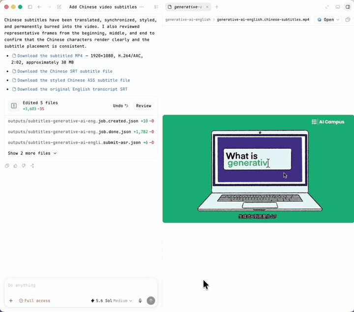
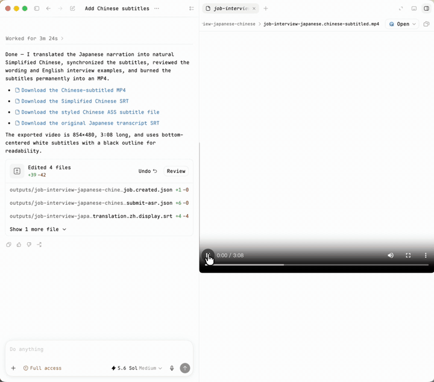
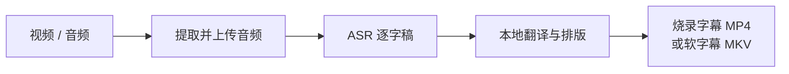

# Video Subtitle Translator

[English](README.md) | [简体中文](README.zh-CN.md)

一个把音频或视频变成翻译字幕，并直接交付可分享视频的 AI Agent Skill。

它通过 OOMOL Fusion API 识别语音，按需翻译字幕，在本地完成排版，默认将字幕烧录进
MP4；也可以把可开关字幕轨封装进 MKV。

## 效果展示

### 英文 → 简体中文字幕

[](assets/demos/english-to-chinese.mp4)

[▶ 查看完整 MP4](assets/demos/english-to-chinese.mp4)

### 日文 → 英文字幕和简体中文字幕

[](assets/demos/japanese-to-english-chinese.mp4)

[▶ 查看完整 MP4](assets/demos/japanese-to-english-chinese.mp4)

日文预览展示的是简体中文字幕烧录效果，同一流程也可以输出英文字幕。演示素材来源与授权见
[详细指南](docs/guide.zh-CN.md#演示素材)。

## 它能做什么

- 将本地音频或视频识别成带时间轴的字幕。
- 翻译字幕，同时保持 cue 顺序和原始时间轴。
- 输出易读的 SRT、VTT 和带样式的 ASS。
- 默认烧录字幕 MP4，也可封装可开关字幕轨 MKV。

## 工作方式



FFmpeg 负责准备音频，`oo` 负责上传和调用 Fusion API ASR，内置工具在本地生成并按需
翻译字幕，最后由 FFmpeg 输出成片。

## 快速开始

需要 Node.js 18+、FFmpeg/FFprobe，以及已登录的
[OOMOL `oo` CLI](https://static.oomol.com/oo-cli/skill-install-guide/install.md)。

安装公开 Skill：

```bash
oo skills install @alwaysmavs/video-subtitle-translator
```

然后直接用自然语言告诉 Agent：

```text
把这个英文视频翻译成简体中文，并将字幕烧录成 MP4。
```

```text
把这个日文视频翻译成英文字幕和中文字幕，并封装成可开关字幕轨的 MKV。
```

没有指定交付方式时，默认输出烧录字幕 MP4。如果需要软字幕，请明确提出 MKV、可开关
字幕轨或不重新编码。

## 文档

- [环境配置、完整流程、输出文件、隐私和故障处理](docs/guide.zh-CN.md)
- [完整 Agent 指令](SKILL.md)
- [oo CLI 安装与恢复](references/oo-cli-setup.md)

## 许可证

[MIT](LICENSE) © 2026 OOMOL Lab
